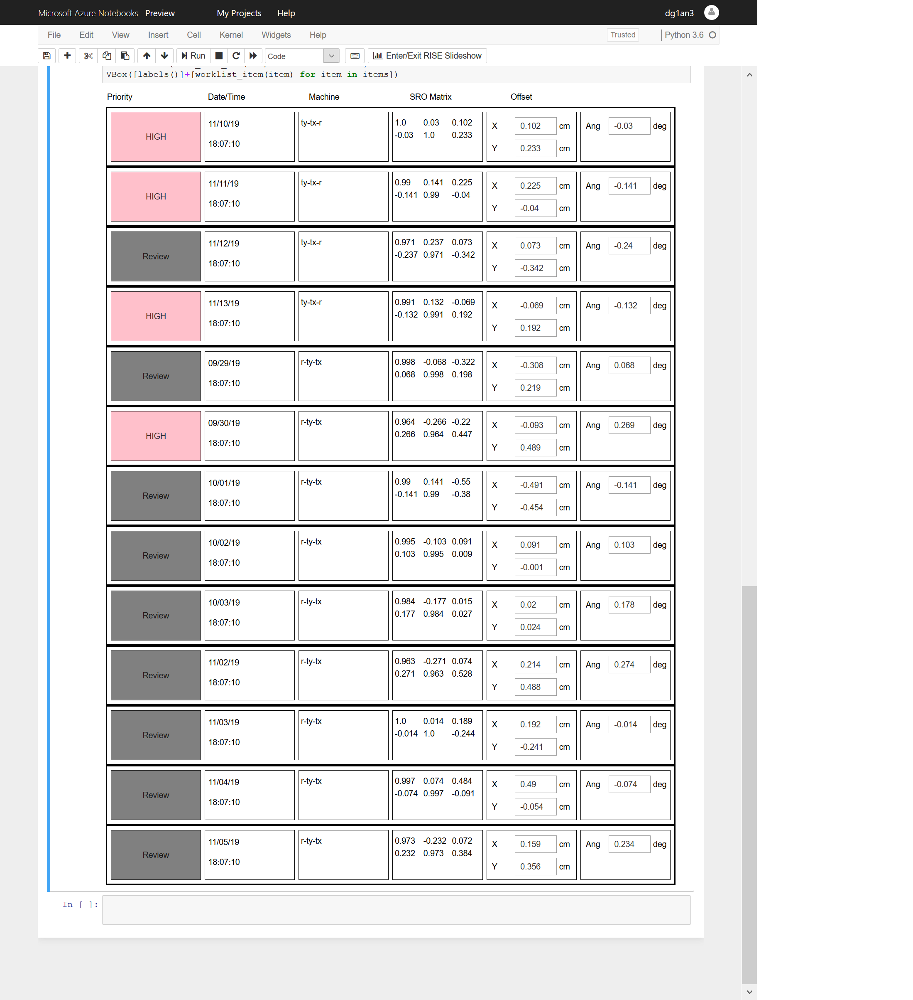

Radiotherapy Image Review Worklist Triage
--------------
At C-MIMI in Austin this year, one of the talks that caught my attention was on a system called [DeepCAT](https://cdn.ymaws.com/siim.org/resource/resmgr/mimi19/oral2/DeepCAT_Yi.pdf), which is a worklist triage system for mammogram screening.
 It uses deep learning to prioritize and filter mammograms.

A similar approach could benefit RT image review. 
Experience indicates that Mosaiq image review users benefit from any streamlining of workflow. 
A triage model would predict:
- Which images are most likely to need more intensive review
- Which are least likely to result in any adjustment

This information could be used to:
- Prioritize the user‘s worklist
- Pre-cache images based on review priority
- Prime an adaptive streaming capability

I‘ve created a simple prototype [QA worklist](https://notebooks.azure.com/dg1an3/projects/worklisttriagemodel), using the rotation model predictions generated by the SRO decoder ring. It prioritizes a list of synthetic images based on the SRO decoder loss function (in this case, categorical cross entropy).  Any registration which is unlikely under the decoder model is shown with a pink button, indicating further review.

This same concept could be applied to a clinical image review worklist, but trained with site-specific metric(s). 
The latent space of patient geometries could be valuable in defining such metrics.
